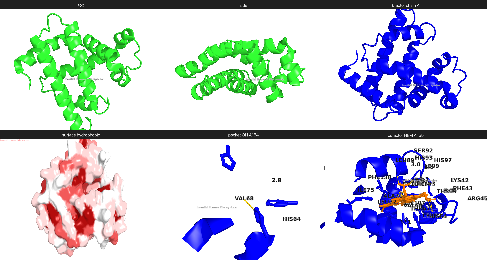

# protein-inspect

A Claude Code plugin that turns any PDB ID, mmCIF/PDB file, or AlphaFold model into a layered semantic representation Claude can reason over fluently — `summary.yaml` describing fold, ligands, cofactors, interfaces, and predicted-confidence regions, plus a labeled grid of PyMOL views composed into a single image.



*Example: `protein-inspect 1mbn --render-views` — myoglobin with a HEM cofactor closeup, hydrophobic surface, and overview panels.*

## What it does

Three layers wired together:

1. **Feature extraction** (gemmi + biotite) — chains, sequence, secondary structure, disulfides, ligands (classified into cofactors / metals / glycans / nucleotides / cryoprotectants / artifacts via a curated table), nucleic-acid chains, peptide ligands, oligomeric state, interface residues, B-factor or pLDDT statistics depending on whether the input is crystal or computed.
2. **A codified decision tree** (`skills/protein-inspect/decision_tree.yaml`) — small interpretable rules that fire on the extracted features. *"If multi-chain and asymmetric ligand occupancy → flag for inspection."* *"If method == AlphaFold → emit pLDDT bands and warn the LLM not to confuse it with B-factor."* *"If 3 aromatics within 5 Å of a small-molecule ligand → aromatic cage detected (nicotinic-receptor-like)."* Roughly 35 rules at v0.1.
3. **A canonical PyMOL view battery** (`skills/protein-inspect/view_battery.yaml`) — 13+ views fired conditionally: overview top/side, pLDDT or B-factor colored cartoon, hydrophobic surface, metal closeup with coordinating residues + distances, ligand pocket closeup with measured H-bond distances, cofactor closeup, glycan closeup, nucleic-acid interface, peptide-ligand interface, interface views, vicinal-SS zooms. Composed into a single labeled montage to bypass the Claude Code CLI's 3-image attachment cap.

Output: `<entry>/summary.yaml` + `<entry>/views/*.png` + `<entry>/montage.png`. Raw coordinates stay on disk and are referenced by path; the LLM-facing layer is structured text and a single composed image.

## Why

Raw PDB/mmCIF text is hostile to LLM reasoning: token-inefficient, no metric closeness, fixed-column formatting. This plugin produces ~10× denser per-token information by operating at the residue / motif / pocket level and externalizing coordinates to a path the LLM doesn't have to read.

The decision tree is hand-curated structural-biology knowledge — the equivalent of a junior biologist's checklist when first looking at a new structure — encoded in YAML so it's versionable, testable, and inspectable, rather than buried in a model's prior.

## Install

There are two ways to install. The first is what you almost certainly want.

### Path 1 — as a Claude Code plugin (recommended)

From inside a Claude Code session:

```
/plugin marketplace add https://gitlab.epfl.ch/benedikt.singer/protein-inspect
/plugin install protein-inspect@protein-inspect-marketplace
```

This registers the `/protein-inspect` slash command, loads `SKILL.md` so Claude automatically knows *when* to invoke it ("look at this PDB", "what's in this structure", etc.) and *how* to interpret its YAML output, and installs the Python package + CLI behind the scenes. After this, any future Claude Code session — in any directory — can act on a structure with a one-line ask.

### Path 2 — as a standalone CLI

If you want the tool outside Claude (in scripts, notebooks, CI):

```bash
uv tool install git+https://gitlab.epfl.ch/benedikt.singer/protein-inspect
```

This puts `protein-inspect` on your `$PATH`. Claude in any session can still call it via Bash, but without the skill registered it won't *automatically* know to render views or how to read the output — you'll need to explain that yourself.

### Dependencies

[PyMOL](https://github.com/schrodinger/pymol-open-source) (required for `--render-views`), and optionally [Merizo](https://github.com/psipred/Merizo) for ML-based domain segmentation.

## Quick start

```bash
# A deposited crystal structure
uv run protein-inspect 1mbn --render-views --out 1mbn/

# A local file (mmCIF or PDB)
uv run protein-inspect /path/design.cif --render-views --out design/

# An AlphaFold model (downloaded from AF-DB)
uv run protein-inspect AF-P00533-F1.cif --render-views --out egfr/

# Highlight a specific motif
uv run protein-inspect 1kxj --motif His153,Asp166,Ser142 --render-views
```

Outputs land under `<out>/`:

```
<entry>/
├── 1mbn.cif              # coords (copied / fetched)
├── summary.yaml          # the LLM-facing semantic layer
├── montage.png           # single labeled grid of all views
└── views/                # individual view PNGs (1200×900)
    ├── 01_top.png
    ├── 02_side.png
    ├── 03_bfactor_chain_A.png
    ├── 04_surface_hydrophobic.png
    ├── 05_pocket_HEM_A.png
    └── ...
```

Then point Claude at it:

```
/protein-inspect Look at summary.yaml and montage.png and tell me what's
in this structure, what its likely function is, and what's noteworthy.
```

## Vision-judged renders (`--judge-views`)

Optional feedback loop on top of the render battery. After PyMOL writes each PNG, a Claude vision model scores it against a per-view rubric declared in `view_battery.yaml`; views that fail the rubric get re-rendered with pre-declared `retry_knobs` (e.g. wider zoom, semi-opaque surface, larger sphere scale). Best-of-N is kept on disk, per-view scores and the judge's specific complaints land in `summary.yaml#visual[].judge`.

```bash
# default judge (claude-sonnet-4-6 — best calibration, ~$0.05-0.25/run)
uv run protein-inspect 1mbn --render-views --judge-views

# cheaper / fast — judge with Haiku 4.5 (~$0.02/run, more permissive)
uv run protein-inspect 1mbn --render-views --judge-views --judge-model claude-haiku-4-5
```

Authentication: needs either `ANTHROPIC_API_KEY` (developer console key) or `ANTHROPIC_AUTH_TOKEN` (Claude Code's bearer token also works, including for Claude Max subscribers). Without credentials the flag is a clean no-op with a single log line.

Worth the call when (a) you need publication-quality figures, (b) the analysis hinges on a specific image being readable (a ligand-pocket closeup where the chemistry must be legible), or (c) you're triaging an unfamiliar design and want a sanity-check that the default views actually showed the relevant features. Leave it off for routine triage, batch screens across many structures, or anything the YAML already answers.

The judge has earned its keep on real runs by catching things the deterministic pipeline can't — degraded renders from a PyMOL license watermark, illegible label sizes at certain zoom levels, and rubric-vs-data mismatches like B-factor spectrum collapse on pre-1980 depositions.

## Examples

Five worked examples ship in `examples/`, each chosen to exercise distinct decision-tree rules:

| example | what it demonstrates |
|---|---|
| [`1mbn`](examples/1mbn/)  | myoglobin + HEM — cofactor classification, heme-chemistry tag, hydrophobic surface around the pocket |
| [`2por`](examples/2por/)  | bacterial porin — aspartate dyad geometry, metals, crystallographic-artifact triage |
| [`9LZM`](examples/9LZM/)  | SARS-CoV-2 main protease (post-cutoff PDB) — Cys/His dyad geometry, multi-domain, post-training-cutoff |
| [`1rva`](examples/1rva/)  | EcoRV + DNA — nucleic-acid interface views, phosphate-binding-loop motif |
| [`AF-P00533-F1_EGFR`](examples/AF-P00533-F1_EGFR/) | AlphaFold-DB EGFR — pLDDT-not-bfactor handling, low-pLDDT region flagging, disulfide-rich extracellular domain |

Each directory contains the full pipeline output (`summary.yaml`, `montage.png`, `views/`, source `.cif`). Open the montage in any of them for a quick visual; open the YAML to see what the decision tree extracted.

## Eval framework

The skill ships with its own evaluation harness in `evals/` — 5 conditions (raw mmCIF / YAML only / YAML+views / baseline / images-only), 29 v1 PDBs + 20 post-cutoff v2 PDBs with hand-written ground truth, automated ground-truth verifier, refusal-retry chain, and aggregate scoring against a 7-criterion 13-point rubric. See `EVAL.md` for the methodology.

V2 holdout (post-2024 cutoff) showed condition C (YAML + view battery + montage) lifts model accuracy by ~10 points over the baseline on structures the model can't have memorized. See `evals/results.md`.

## Repo layout

```
src/protein_inspect/           # feature extractor, decision engine, PyMOL runner, CLI
skills/protein-inspect/        # SKILL.md, decision_tree.yaml, view_battery.yaml, ligand_classes.yaml
schema/summary.schema.json     # JSON Schema for summary.yaml
examples/                      # 5 worked examples (above)
evals/                         # evaluation harness + ground-truth sets + results
tests/                         # 148 pytest tests
.claude-plugin/                # plugin.json, marketplace.json
PLAN.md                        # architectural notes, design decisions, open questions
EVAL.md                        # eval methodology
```

## Status

v0.1.0 — actively developed. Test suite: 148/148 green. See `PLAN.md` for open work items.

## License

MIT.

## Acknowledgements

PyMOL access via [claudemol](https://github.com/anthropics/claudemol). Structural parsing by [gemmi](https://gemmi.readthedocs.io/) and [biotite](https://www.biotite-python.org/). Build inspired by the broader Anthropic [skills](https://github.com/anthropics/skills) effort.
